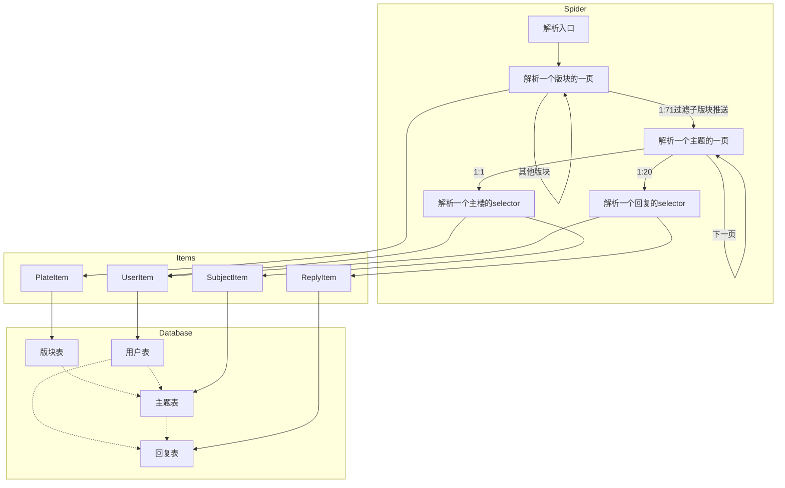

# 爬虫设计

本文档描述了爬虫`forum`的结构。

## 设计

```mermaid

graph TD
    subgraph Spider
        parse[解析入口]
        parse_plate_page[解析一个版块的一页]
        parse_thread_page[解析一个主题的一页]
        parse_subject[解析一个主楼的selector]
        parse_reply[解析一个回复的selector]

        parse --> parse_plate_page
        parse_plate_page --下一页--> parse_plate_page
        parse_plate_page --其他版块--> parse_plate_page
        parse_plate_page --1:71过滤子版块推送--> parse_thread_page
        parse_thread_page --下一页--> parse_thread_page
        parse_thread_page --1:1--> parse_subject
        parse_thread_page --1:20--> parse_reply
    end

    subgraph Items
        PlateItem
        UserItem
        SubjectItem
        ReplyItem
    end

    subgraph Database
        TablePlate[版块表]
        TableUser[用户表]
        TableThread[主题表]
        TableReply[回复表]
    end

    
    parse_plate_page --> PlateItem
    parse_subject --> SubjectItem
    parse_subject --> UserItem
    parse_reply --> ReplyItem
    parse_reply --> UserItem

    PlateItem --> TablePlate
    UserItem --> TableUser
    TablePlate -.-> TableThread
    TableUser -.-> TableThread
    TableUser -.-> TableReply
    TableThread -.-> TableReply
    ReplyItem --> TableReply
    SubjectItem --> TableThread
```